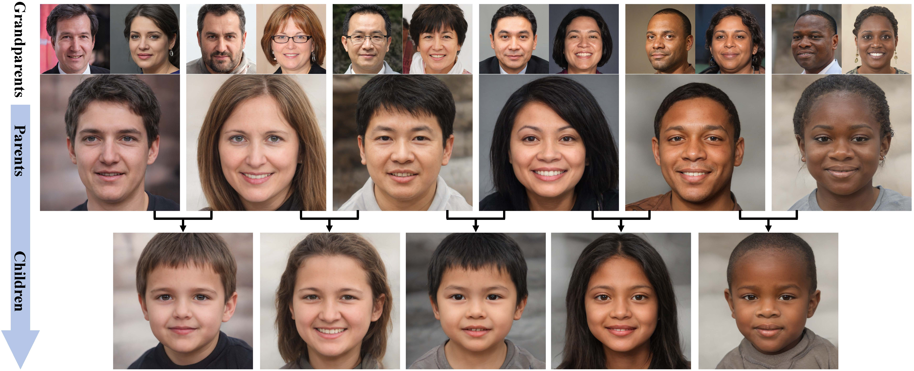
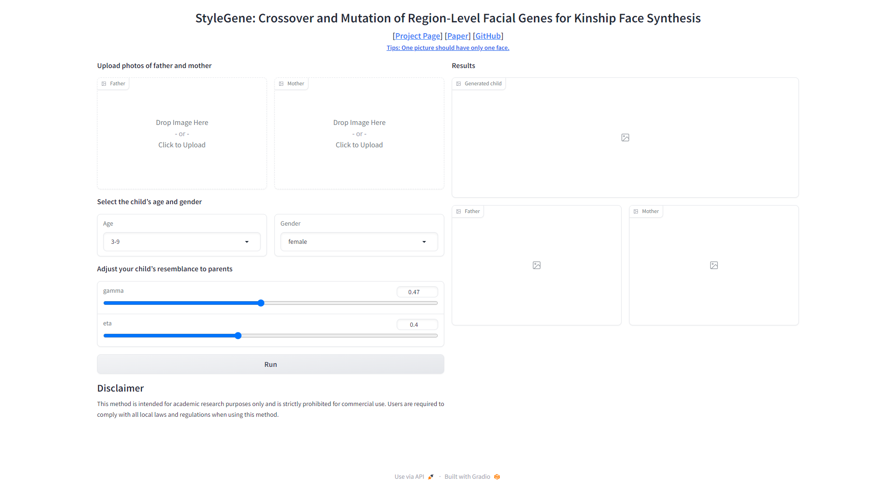

# StyleGene (CVPR2023 Highlight)
This repository contains the implementation of the following paper:
> **StyleGene: Crossover and Mutation of Region-level Facial Genes for Kinship Face Synthesis** <br>
> [Hao Li](https://github.com/wmpscc) , [Xianxu Hou](https://scholar.google.com/citations?user=oK8Q-HwAAAAJ) , [Zepeng Huang](https://github.com/josephzpng), [Linlin Shen](https://scholar.google.com/citations?user=AZ_y9HgAAAAJ)<br>
> From [CVI@SZU](https://github.com/CVI-SZU), Shenzhen University <br>
> IEEE/CVF International Conference on Computer Vision (CVPR), 2023 <br>
> [[Paper](https://openaccess.thecvf.com/content/CVPR2023/html/Li_StyleGene_Crossover_and_Mutation_of_Region-Level_Facial_Genes_for_Kinship_CVPR_2023_paper.html)] | [[Project Page](https://wmpscc.github.io/stylegene/)] | [[Video](https://youtu.be/TDqGaL79_pg)] | [[Slide](https://drive.google.com/file/d/1CrhpHv8t0EDD4X4UwrYMBNYVAyyzUBF1/view)]
 
<br>
The first row is the input grandparents, and the second and third rows are their descendants generated by our method.

## Abstract
> High-fidelity kinship face synthesis has many potential applications, such as kinship verification, missing child identification, and social media analysis. However, it is challenging to synthesize high-quality descendant faces with genetic relations due to the lack of large-scale, high-quality annotated kinship data. This paper proposes RFG (Region-level Facial Gene) extraction framework to address this issue. We propose to use IGE (Image-based Gene Encoder), LGE (Latent-based Gene Encoder) and Gene Decoder to learn the RFGs of a given face image, and the relationships between RFGs and the latent space of StyleGAN2. As cycle-like losses are designed to measure the $L_2$ distances between the output of Gene Decoder and image encoder, and that between the output of LGE and IGE, only face images are required to train our framework, i.e. no paired kinship face data is required. Based upon the proposed RFGs, a crossover and mutation module is further designed to inherit the facial parts of parents. A Gene Pool has also been used to introduce the variations into the mutation of RFGs. The diversity of the faces of descendants can thus be significantly increased. Qualitative, quantitative, and subjective experiments on FIW, TSKinFace, and FF-Databases clearly show that the quality and diversity of kinship faces generated by our approach are much better than the existing state-of-the-art methods.

## Getting Started
### Clone repo
```shell
git clone https://github.com/CVI-SZU/StyleGene.git
cd StyleGene
```

### Environment Setup
It is suggested to create a Conda environment and install the following requirements
```shell
pip3 install -r requirements.txt
```
**Requirements:**
- Python 3.9
- torch 1.12.1
- Pillow 9.2.0
- einops 0.3.2
- easydict 1.10
- gradio 3.32.0
- onnxruntime 1.9.0
- opencv-python 4.5.4.60
- pandas 1.4.4
- numpy 1.21.5

### Download Checkpoints
We have uploaded all the necessary [weights](https://huggingface.co/wmpscc/StyleGene_CKPT), please clone to the `checkpoints/` directory.
```shell
mkdir checkpoints
cd checkpoints
git clone https://huggingface.co/wmpscc/StyleGene_CKPT
```
Put the pre-trained models under `checkpoints/` as follows:
```text
StyleGene
└── checkpoints
    ├── e4e_ffhq_encode.pt
    ├── geneFactorPool.pkl
    ├── res34_fair_align_multi_7_20190809.pt
    ├── shape_predictor_68_face_landmarks.dat.bz2
    ├── stylegan2-ffhq-config-f.pt
    └── stylegene_N18.ckpt
```

### Generation
Start the interactive interface and start playing.
```shell
cd StyleGene
python app.py
```
The default URL is  [http://127.0.0.1:7860/](http://127.0.0.1:7860/). If you are running on the server, please pay attention to open port `7860`.



## Citation
If you are using our code, please consider citing our paper.
```
@inproceedings{li2023stylegene,
  title={StyleGene: Crossover and Mutation of Region-Level Facial Genes for Kinship Face Synthesis},
  author={Li, Hao and Hou, Xianxu and Huang, Zepeng and Shen, Linlin},
  booktitle={Proceedings of the IEEE/CVF Conference on Computer Vision and Pattern Recognition},
  pages={20960--20969},
  year={2023}
}
```

## Disclaimer
This method is intended for academic research purposes only and is strictly prohibited for commercial use. Users are required to comply with all local laws and regulations when using this method.

## Acknowledgement
Part of the code comes from other repo, please abide by the original open source license for the relevant code.
- [StyleGAN 2 in PyTorch](https://github.com/rosinality/stylegan2-pytorch)
- [StyleGAN2 — Official TensorFlow Implementation](https://github.com/NVlabs/stylegan2)
- [Designing an Encoder for StyleGAN Image Manipulation](https://github.com/omertov/encoder4editing)
